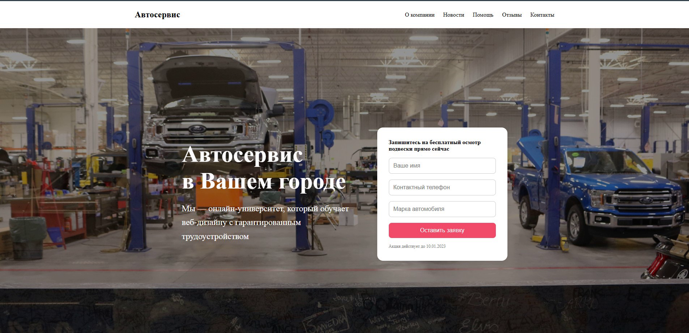

# Сайт автосервиса

Адаптивный лендинг для автосервиса, сверстанный по дизайн-макету из Figma.

## Стек технологий

- HTML5
- CSS3 (Flexbox, Grid)
- Media queries (адаптив под 768px и 480px)
- Семантическая верстка
- Pixel Perfect

## Адаптивность

Проект адаптирован под:

- Десктоп (≥ 1024px)
- Планшет (768px)
- Смартфон (≤ 480px)

Все секции сайта корректно отображаются на разных устройствах.

## Дизайн

Макет был предоставлен в Figma.  
**Design by**: [Ссылка на макет](https://www.figma.com/design/21sqAicmOxEWbIfxXQbGEK/%D0%B0%D0%B2%D1%82%D0%BE%D1%81%D0%B5%D1%80%D0%B2%D0%B8%D1%81?node-id=463-0&t=TzFxzuHVZIDJN1KM-1)

## PS

Из-за особенностей макета не удалось реализовать один из блоков
